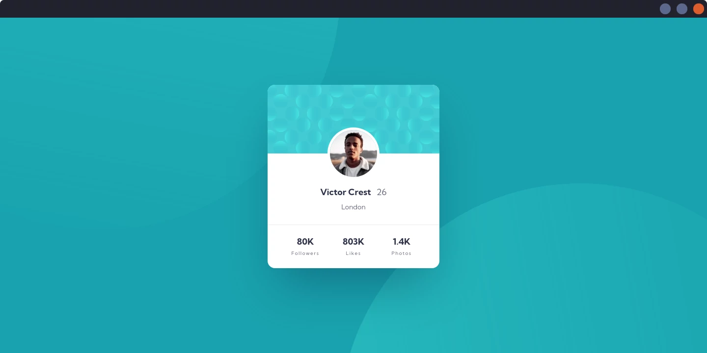

# Frontend Mentor - Profile card component

This is a solution to the [Profile card component challenge on Frontend Mentor](https://www.frontendmentor.io/challenges/profile-card-component-cfArpWshJ).

## Links
- Solution URL: [GitHub](https://github.com/Michal-Majchrzak/fm-profile-card-component)
- Live Site URL: [GitHubPages](https://michal-majchrzak.github.io/fm-profile-card-component/)

## Preview

### Mobile

Uicons by [Flaticon](https://www.flaticon.com/uicons)

### Desktop

## Built with

- HTML5 markup
- CSS / Flexbox
- Responsive design
- Mobile-first workflow

## Author

- Frontend Mentor - [@Michal-Majchrzak](https://www.frontendmentor.io/profile/Michal-Majchrzak)